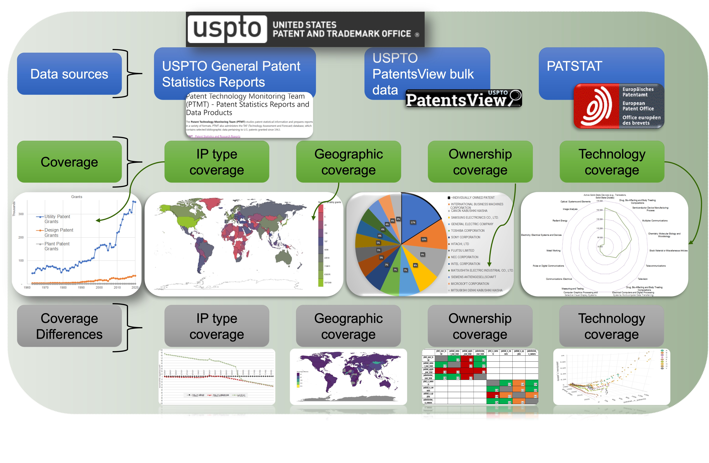

# Comparison of the coverage of the USPTO’s PatentsView and the EPO’s PATSTAT patent databases: a reproducibility case study of the USPTO General Patent Statistics Reports

[Mpho Mafata](https://orcid.org/0000-0002-6468-7193) 1,2*, [Ian D. van der Linde](https://orcid.org/0000-0001-9232-9599) 1 [Jos J. Winnink](https://orcid.org/0000-0002-9115-6419) 3, and [Robert J.W. Tijssen](https://orcid.org/0000-0001-5237-9583) 2,3

1. Centre for Research on Evaluation, Science, and Technology (CREST), Stellenbosch University, Krotoa building, Victoria Street, Stellenbosch, South Africa, 7600 
2. DSI-NRF Centre of Excellence in Scientometrics and Science, Technology, and Innovation Policy (SciSTIP), Stellenbosch University, Krotoa building, Victoria Street, Stellenbosch, South Africa, 7600
3. Centre for Science and Technology Studies (CWTS), Leiden University, Kolffpad 1, P.O. Box 905, Leiden 2300 AX, The Netherlands
* Corresponding author: mafata@sun.ac.za 

__Keywords__: Patents, scientometrics, bibliometrics, patentometrics, patent metrics, patent output metrics, patent-based bibliometrics, patinformatics, PatentsView, PATSTAT, USPTO, database coverage.

# Abstract
Patent statistics from various sources are often cited in science, technology, and innovation (STI) studies and STI policies, usually as a proxy for measuring output and activity related to technological innovation. But how reliable are those statistics? The reproducibility of numerical data originating from these information sources may be low, as the query methodology and data coverage of those sources is often omitted or unclear in documents that report on patent-based data collection and comparative analysis. Given the importance of reliable, reproducible statistics as the foundation of evidence-informed policymaking, this study aimed to conduct a reproducibility exercise for the patent statistics produced by USPTO’s Patent Technology Monitoring Team (PTMT) and compare them with statistics derived from PatentsView and PATSTAT patent databases. Comparing the two databases, four types of coverage were investigated, namely: intellectual property (IP) types, geographic (countries and territories) coverage, owner/inventor coverage, and technological coverage. Although there were similarities in the historical trends between the coverage of PATSTAT and PatentsView, the absolute counts data presented high levels of variability. PatentsView had highly varying coverage compared to PTMT, which may be due to excessive generation of secondary fields derived from the original data. Additionally, PATSTAT covered earlier dates (from 1790) compared to PatentsView (from 1976). As for tracking of relative trends in patent output, either database could be chosen, but the choice will highly influence the outcomes of patent-based bibliometric studies.

# Conclusions and recommendations
This study showed that, when accounting for standardised query methodology across different data sources, the results vary depending on the data source – making patent statistics and patent bibliometrics less robust and reliable. The study showed greater variations between databases for derived fields, therefore, it is best to use the raw data as reported and when reporting aggregated fields to give the full details of how the aggregation was done. For example, for cases of emerging fields where new fields are constructed from existing technology classes, or when using patenting families since this can vary depending on the database. Given the variations between data sources, reporting patent statistics should be more than just a counting game since these can have real-world consequences for the information quality of policy debate or policymaking. The consequences of incomplete data, irreproducible studies, unclear methodology, and a lack of relevant technical details can have major detrimental effects on how patent statistics are used and interpreted. It is important to stress how vital it is that patent statistics are generated soundly and transparently, to ensure that any analytical work that builds upon that, especially for (supra)national STI policies and reviews, draw valid conclusions. Patent statistic producers should follow a consistent, reproducible methodology while patent statistics readers and policymakers should view patent statistics with scepticism when they the methodologies are not clearly detailed.
